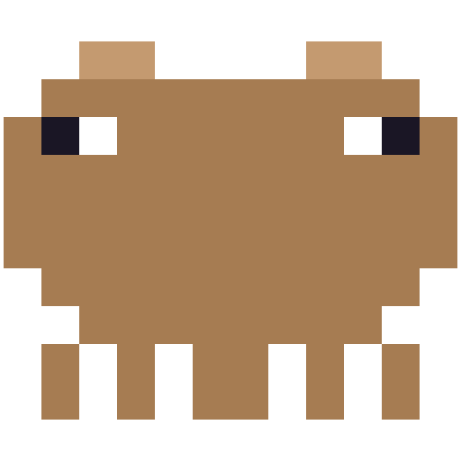

# Pebble

> A lightweight, open-source floating panel for monitoring AI coding agents. Built with Tauri + React + TypeScript.

<p align="center">
  
</p>

[English](README.md) · [中文](README_CN.md)

Pebble is a cross-platform desktop application that monitors multiple Claude Code instances running across different terminals, eliminating the pain of manually hunting through windows and panes to find the right session.

Inspired by [Vibe Island](https://vibeisland.app), but **open-source, lightweight, and cross-platform**.

---

## Why Pebble?

If you work with multiple Claude Code sessions across iTerm2 tabs, tmux panes, or terminal windows, you know the struggle:

- Which tab is currently running a long task?
- Which session just asked for a permission approval?
- Where did that background job finish?

Pebble solves this by providing a **non-intrusive floating panel** that:
- Automatically discovers all running Claude Code instances
- Shows real-time status at a glance
- Notifies you when tasks complete
- Jumps directly to the correct terminal pane with one click
- Lets you monitor permission requests right from the panel

---

## Features

### MVP (Current)
- **Auto-Discovery**: Scans the system for running `claude` processes automatically
- **Real-Time Status Monitor**: Displays `waiting` / `executing` / `needs_permission` states updated via Claude Code hooks
- **System Notifications**: Sends native macOS and Windows notifications when a task completes
- **System Tray Icon**: Pixel-art capybara tray icon on macOS and Windows with a "Quit" menu
- **Tray Toggle**: Left-click the tray icon to show/hide and expand/collapse the panel
- **iTerm2 Precise Jump**: Click any instance to focus the exact iTerm2 tab/pane via AppleScript
- **Permission Read-Only Alert**: See which tool is requesting permission and handle it in the terminal
- **Notch-Style Panel**: Concave fillets at the top corners blend seamlessly with the MacBook notch
- **Always-On-Top Floating Panel**: Stays visible without stealing focus from your editor
- **Zero Config Setup**: Automatically registers Claude Code hooks on first launch

### Roadmap
- [ ] Support for additional terminals (Terminal.app, tmux direct, Windows Terminal, Linux terminals)
- [ ] Support for additional agents (Codex, Cursor, Gemini CLI, etc.)
- [ ] Markdown plan preview
- [ ] Sound alerts
- [ ] Drag-to-move window positioning
- [ ] Signed DMG and GitHub Releases

---

## Installation

### macOS

Download the latest `Pebble.app` from [GitHub Releases](#) (coming soon) and move it to your `Applications` folder.

Or build from source:

```bash
git clone https://github.com/yuhencloud/Pebble.git
cd Pebble/pebble-app
npm install
npm run tauri build -- --target aarch64-apple-darwin
```

The built app will be available at:
```
src-tauri/target/aarch64-apple-darwin/release/bundle/macos/Pebble.app
```

### Windows

Build from source:

```bash
git clone https://github.com/yuhencloud/Pebble.git
cd Pebble/pebble-app
npm install
npm run tauri build
```

The built app will be available at:
```
src-tauri/target/x86_64-pc-windows-msvc/release/bundle/msi/Pebble_0.1.0_x64_en-US.msi
```

### Requirements
- macOS 14+ (primary target)
- Windows 10/11
- Node.js 20+
- Rust 1.70+

---

## Usage

1. **Launch Pebble**
2. **Start Claude Code** in iTerm2 (or any supported terminal)
3. **Watch the panel** — Pebble will automatically list your instances
4. **Click an instance** to jump directly to its iTerm2 pane
5. **Send a message to Claude Code** — the status dot will turn green (`executing`)
6. **Wait ~30 seconds after completion** — it turns yellow (`waiting`) and a native notification appears
7. **Handle permissions** — when a red permission card appears on the panel, go to the terminal to respond
8. **Use the tray icon** — left-click to toggle the panel, right-click for the menu

---

## Development

```bash
cd pebble-app
npm install
npm run tauri dev
```

This starts the Vite dev server and the Tauri app in watch mode.

### Project Structure

```
pebble-app/
├── src/                   # React frontend
│   ├── App.tsx           # Main panel UI
│   ├── App.css           # Panel styles
│   └── main.tsx          # React entry
├── src-tauri/            # Rust backend
│   ├── src/main.rs       # Core logic (discovery, hooks, tray, iTerm2 jump)
│   ├── Cargo.toml        # Rust dependencies
│   └── tauri.conf.json   # App window configuration
├── package.json
├── vite.config.ts
└── ...
```

### How It Works

```
┌─────────────────────────────────────────┐
│           Pebble (Tauri App)            │
├──────────────────┬──────────────────────┤
│   Rust Backend   │   React Frontend     │
│                  │                      │
│  - Hook listener │  - Instance list UI  │
│  - Process disco │  - Status indicators │
│  - Terminal jump │  - Notification mgr  │
│  - IPC bridge    │  - Floating panel    │
│  - System tray   │  - Permission hints  │
└──────────────────┴──────────────────────┘
         │                    │
         ▼                    ▼
┌─────────────────┐  ┌───────────────────┐
│  Claude Code    │  │  System APIs      │
│  Hooks / Events │  │  - Notifications  │
│                 │  │  - Window mgmt    │
│                 │  │  - Tray icon      │
│                 │  │  - Terminal focus │
└─────────────────┘  └───────────────────┘
```

**Discovery**: The Rust backend uses `ps` + `lsof` to find `claude` processes and their working directories.

**Hook Events**: Pebble starts a local HTTP server (`127.0.0.1:9876`) and writes hook commands into your `~/.claude/settings.json`. When Claude Code triggers events (`UserPromptSubmit`, `PostToolUse`, `Stop`), a tiny Node.js bridge script forwards them to Pebble.

**Status Inference**: `UserPromptSubmit` sets status to `executing`. If no hook events arrive for 30 seconds, the status returns to `waiting` and a system notification is fired.

**Tray Icon**: Left-clicking the tray icon shows the window and toggles the panel between expanded and collapsed. Right-clicking opens a context menu with a "Quit" option.

**iTerm2 Jump**: Clicking an instance reads the process TTY, then uses AppleScript to iterate iTerm2 windows/tabs/sessions and focus the matching one.

---

## Contributing

Contributions are welcome! Please feel free to submit issues or pull requests.

For major changes, please open an issue first to discuss what you would like to change.

### Development Setup

1. Fork the repository
2. Create your feature branch (`git checkout -b feature/amazing-feature`)
3. Commit your changes (`git commit -m 'Add amazing feature'`)
4. Push to the branch (`git push origin feature/amazing-feature`)
5. Open a Pull Request

---

## License

[MIT](LICENSE)

---

## Acknowledgements

- Inspired by [Vibe Island](https://vibeisland.app) — a beautiful macOS-native agent monitor
- Built with [Tauri](https://tauri.app/), [React](https://react.dev/), and [Rust](https://www.rust-lang.org/)
